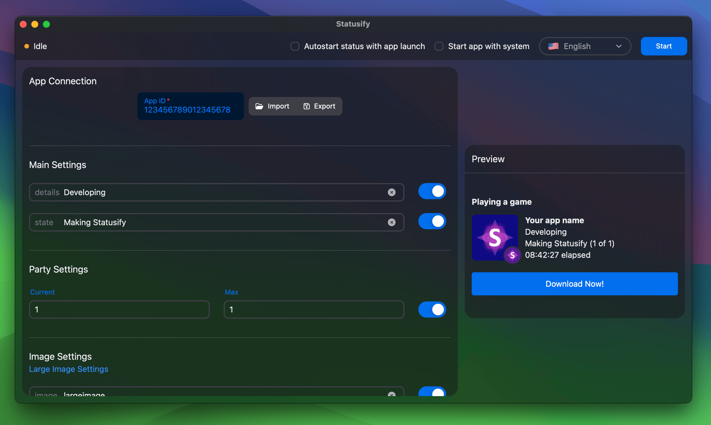
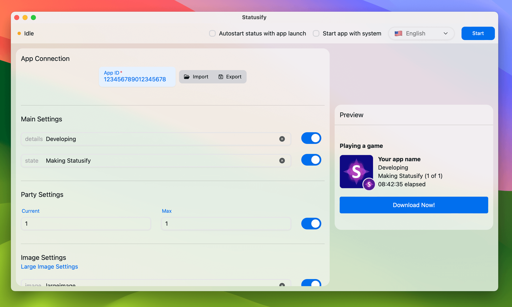

<div align="center" style="display:grid;place-items:center;">
<p>
    
</p>
<h1>Statusify</h1>


<h4>Discord Rich Presence GUI Application for Window, macOS, and Linux</h4>
</div>

<p align="middle">
    
    
</p>

## About

Statusify is an open source simple and easy-to-use cross platform GUI application for setting up Discord Rich Presence. It allows you to create and customize your own rich presence and preview it in real-time. It is a tiny application that barely uses any disk space.

> [!NOTE]
> Statusify is currently in development and is only available for testing purposes as an alpha release.

## Installation

You can download the precompiled binaries for your platform from the table below. The binaries automatically update themselves to the latest version when a new release is available. You can also install Statusify using a package manager.

*The binaries are signed*

| Platform |  Architecture | Download |
| -------- | -------------- | -------- |
| Windows  | x64            | [Statusify.windows-x86_64.exe](https://github.com/Orphoros/Statusify/releases/latest/download/Statusify.windows-x86_64.exe) |
| macOS    | x64 (Intel)    | [Statusify.darwin-x86_64.dmg](https://github.com/Orphoros/Statusify/releases/latest/download/Statusify.darwin-x86_64.dmg) |
| macOS    | Apple Silicon  | [Statusify.darwin-aarch64.dmg](https://github.com/Orphoros/Statusify/releases/latest/download/Statusify.darwin-aarch64.dmg) |
| Debian   | x64            | [Statusify.linux-x86_64.deb](https://github.com/Orphoros/Statusify/releases/latest/download/Statusify.linux-x86_64.deb) |
| Linux (AppImage) | x64    | [Statusify.linux-x86_64.AppImage](https://github.com/Orphoros/Statusify/releases/latest/download/Statusify.linux-x86_64.AppImage) |

### Scoop installation for Windows

You can install Statusify on Windows using [Scoop](https://scoop.sh/).

```pwsh
scoop bucket add orphoros_scoop-bucket https://github.com/Orphoros/scoop-bucket
```

```pwsh
scoop install statusify
```

### Homebrew installation for macOS

You can install Statusify on macOS using [Homebrew](https://brew.sh/).

```bash
brew tap orphoros/core
```

```bash
brew install --cask statusify
```

## Key Features

- Set up your own custom rich presence.
- Configure the details and state text.
- Set the large and small images and their tooltips.
- Define when the activity starts to display how long you have been doing it.
- Display a party size.
- Add a button with a label and a URL.
- Toggle any of the rich presence elements on and off.
- Save your editor settings, so you don't have to reconfigure it every time you open the app.
- Close to the system tray so the app can run in the background.
- Save your rich presence settings to a file and load them later.
- Support old 18-digit and new 19-digit Discord client IDs.

## Supported Platforms

Statusify is available for the following platforms:

<p align="left">
    
    
    
</p>

Statusify is officially supported and tested on:

- Windows 10
- macOS Sonoma (Apple Silicon)

## Supported Languages

Statusify is available in the following languages:

| Language   | Support  | Translation |
| ---------- | -------- | ----------- |
| English    | Official | Full        |
| Magyar     | Official | Partial     |
| Nederlands | Official | Partial     |

English is the default language. Any untranslated strings will be displayed in English.

If you would like to contribute to the translation of Statusify, you can do so by creating a pull request with the translation of [locale_template.json](./locale_template.json) in your language. The file must be named as `{language_code}_{COUNTRY_CODE}.json`, example `en_US.json`.

Make sure to follow the [CODE_OF_CONDUCT](./CODE_OF_CONDUCT.md) and the [CONTRIBUTING](./CONTRIBUTING.md) guidelines.

## Technologies

<p align="left">
    
    
    
    
</p>

## Motivation

Statusify was created as a proof of concept to test the capabilities of the Tauri framework. Electron is a popular choice for creating cross-platform desktop applications, however the produced binaries have a large base size due to the inclusion of the Chromium browser. Also, Electron applications are known to consume a lot of memory. This project aims to validate the Tauri framework as a lightweight alternative to Electron for building cross platform desktop applications.

## Troubleshoot

If Statusify is not working as expected, you can locate the log files in the following directories:

- Windows: `%APPDATA%\com.orphoros.statusify\logs`
- macOS: `~/Library/Logs/com.orphoros.statusify/`
- Linux: `~/.config/com.orphoros.statusify/logs`

### Developer's guide

<details><summary>1. Setup the project</summary>

Clone the repository and install the dependencies.

```bash
git clone git@github.com:Orphoros/Statusify.git
```

Install the dependencies.

```bash
npm i
```

</details>

<details><summary>2. Run the project</summary>

Run the app in development mode.

```bash
npm run tauri dev
```

</details>

</details>

<details><summary>3. Update dependencies</summary>

Fetch new updates from the repository.

```bash
npm run upgrade
```

Create the lock file for the new dependencies.

```bash
npm run lock
```

</details>

---

## Disclaimer

> [!WARNING]
> Discord is a trademark of Discord Inc. Statusify is not affiliated with Discord Inc. in any way and is not an official application. Statusify is an open-source project made for educational purposes and is not responsible for any misuse of the application. Use the application at your own risk.
