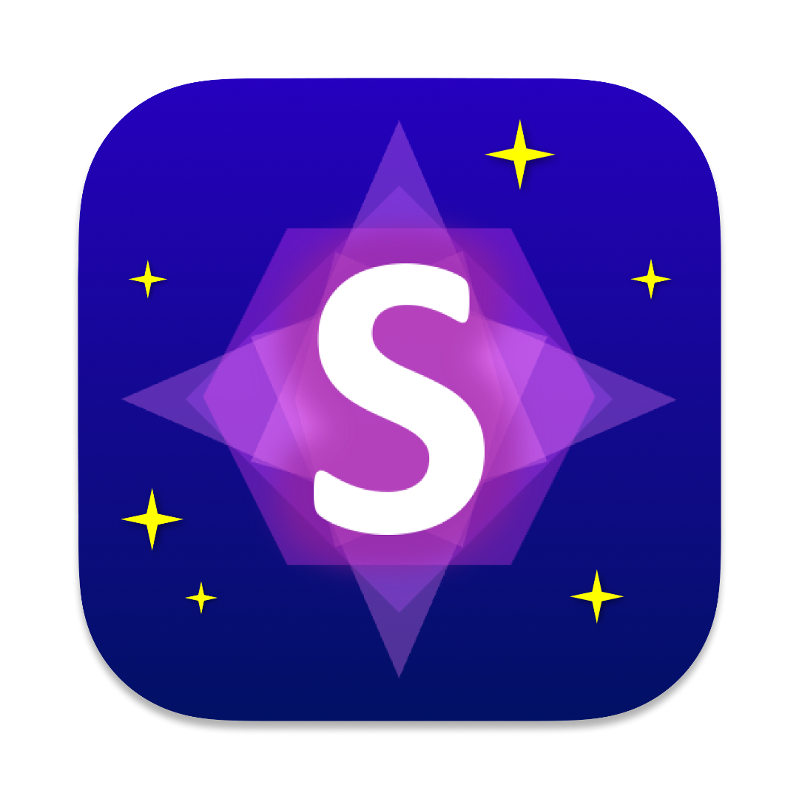

<div align="center" style="display:grid;place-items:center;">
<p>
    
</p>
<h1>Statusify</h1>


<h4>Discord Rich Presence GUI Application for Window, macOS, and Linux</h4>
</div>

<p align="middle">
    
    
</p>

## About

Statusify is an open source simple and easy-to-use cross platform GUI application for setting up Discord Rich Presence. It allows you to create and customize your own rich presence and preview it in real-time. It is a tiny application that barely uses any disk space.

> [!NOTE]
> Statusify is currently in development and is only available for testing purposes as an alpha release.

## Key Features

- Set up your own custom rich presence.
- Configure the details and state text.
- Set the large and small images and their tooltips.
- Define when the activity starts to display how long you have been doing it.
- Display a party size.
- Add a button with a label and a URL.
- Toggle any of the rich presence elements on and off.
- Save your editor settings, so you don't have to reconfigure it every time you open the app.

## Supported Platforms

Statusify is available for the following platforms:

<p align="left">
    
    
    
</p>

Statusify is officially supported and tested on:

- Windows 10
- macOS Sonoma (Apple Silicon)

## Technologies

<p align="left">
    
    
    
    
</p>

### Developer's guide

<details><summary>1. Setup the project</summary>

1. Clone the repository and install the dependencies.

```bash
git clone git@github.com:Orphoros/Statusify.git
```

2. Install the dependencies.

```bash
npm i
```

</details>

<details><summary>2. Run the project</summary>

Run the app in development mode.

```bash
npm run tauri dev
```

</details>

</details>

<details><summary>3. Update dependencies</summary>

1. Fetch new updates from the repository.

```bash
npm run upgrade
```

2. Create the lock file for the new dependencies.

```bash
npm run lock
```

</details>

---

## Disclaimer

> [!WARNING]
> Discord is a trademark of Discord Inc. Statusify is not affiliated with Discord Inc. in any way and is not an official application. Statusify is an open-source project made for educational purposes and is not responsible for any misuse of the application. Use the application at your own risk.
